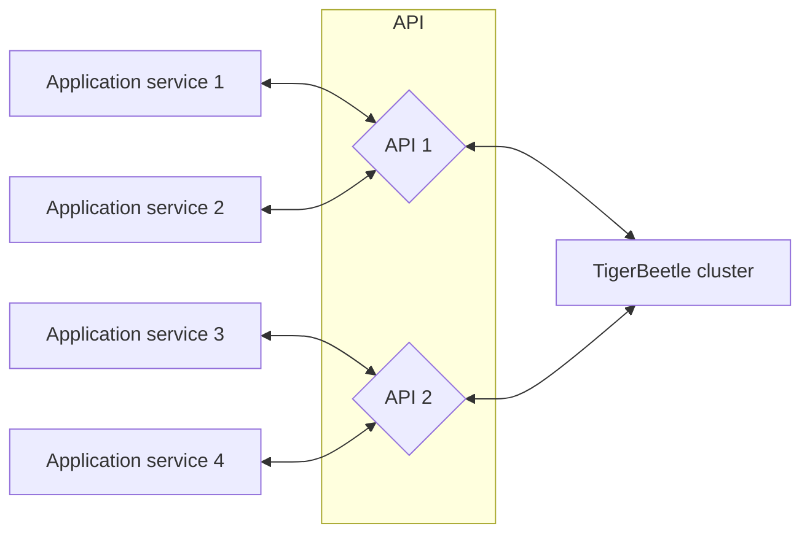

# Client Requests

A _request_ is a [batch](#batching-events) of one or more
[operation events](../reference/operations/index.md) sent to the cluster in a single message.

- All events within a request batch share the same operation type.
- The cluster commits an entire batch at once, each event in series.
- The cluster returns a single reply for each unique request it commits.
- The cluster's reply contains results corresponding to each event in the request.
- Unless [linked](../reference/transfers.md#flagslinked), events within a request
  [succeed or fail](../reference/operations/create_transfers.md#result) independently.

## Batching Events

To achieve high throughput, TigerBeetle amortizes the overhead of consensus and I/O by
batching many operation events in each request. For the best performance, each request should batch
as many events as possible. Typically this means funneling events through fewer client instances.

The maximum number of events per batch depends on the maximum message size
(`config.message_size_max`) and the operation type.
(TODO: Expose batch size in the client instead).

In the default configuration, the batch sizes are:

| Operation          | Batch Size |
| ------------------ | ---------: |
| `lookup_accounts`  | 8190       |
| `lookup_transfers` | 8190       |
| `create_accounts`  | 8190       |
| `create_transfers` | 8190       |

Presently the client application is responsible for batching events, but only as a stopgap
because this has not yet been implemented within the clients themselves.

Read more about how two-phase transfers work with each client.

* [Node](/src/clients/node/README.md#batching)
* [Go](/src/clients/go/README.md#batching)
* [Java](/src/clients/java/README.md#batching)

## API Layer Architecture

In some application architectures, the number of services that need to query TigerBeetle may:
- [exceed `config.clients_max`](./client-sessions.md#eviction), or
- may require additional [batching](#batching-events) to optimize throughput.

Rather than each service connecting to TigerBeetle directly, application services can forward their
requests to a pool of intermediate services (the "API layer") which can coalesce events from
many application services into requests, and forward back the respective
replies. This approach enables larger batch sizes and higher throughput, but comes at a cost: the
application services' sessions are no longer linearizable, because the API services may restart at
any time relative to the application service.

### Queues and Workers

If you are making requests to TigerBeetle from workers
pulling jobs from a queue, you can batch requests to
TigerBeetle by having the worker act on multiple jobs from
the queue at once rather than one at a time. i.e. pulling
multiple jobs from the queue rather than just one.
