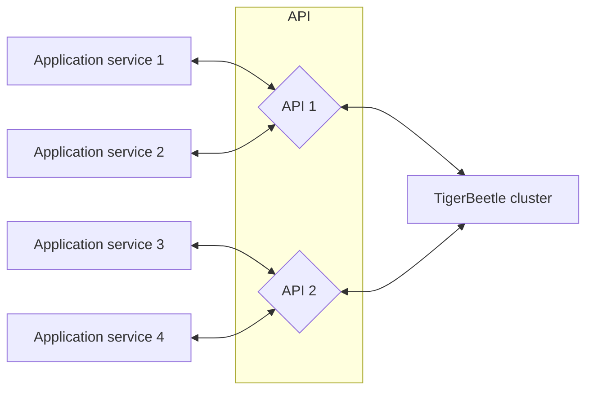

# Client Requests

A _request_ is a [batch](#batching-events) of one or more [operation
events](../reference/operations/index.md) sent to the cluster in a single message.

- All events within a request batch must be of the same
  [operation](../reference/operations/index.md) type. You cannot, for example, create accounts and
  transfers in the same request.
- The cluster commits an entire batch at once. Events are applied in series, such that successive
  events observe the effects of previous ones and event timestamps are [totally
  ordered](time.md#timestamps-are-totally-ordered).
- Events within a request [succeed or fail](../reference/operations/create_transfers.md#result)
  independently unless they are explicitly [linked](../reference/transfers.md#flagslinked).
- The cluster returns a single reply for each unique request it commits. The reply contains a
  [result](../reference/operations/create_transfers.md#result) for each event in the request.

## Batching Events

To achieve high throughput, TigerBeetle amortizes the overhead of consensus and I/O by batching many
operation events in each request. 

For the best performance, each request should batch as many events as possible. Typically this means
funneling events through fewer client instances (e.g. a single client instance per process).

The maximum number of events per batch depends on the maximum message size and the operation type.
(TODO: Expose each operation's batch sizes in the client).

In the default configuration, the batch sizes are:

| Operation               | Request Batch Size (Events) | Reply Batch Size (Results) |
| ----------------------- | --------------------------: | -------------------------: |
| `lookup_accounts`       |                        8190 |                       8190 |
| `lookup_transfers`      |                        8190 |                       8190 |
| `create_accounts`       |                        8190 |                       8190 |
| `create_transfers`      |                        8190 |                       8190 |
| `get_account_transfers` |                           1 |                       8190 |
| `get_account_history`   |                           1 |                       8190 |

You can design your application to batch events manually. However, client instances automatically
batch requests of the same operation type. Therefore, sharing the same client instance between
multiple threads or tasks enables events to be batched transparently.

- [Node](/src/clients/node/README.md#batching)
- [Go](/src/clients/go/README.md#batching)
- [Java](/src/clients/java/README.md#batching)
- [.NET](/src/clients/dotnet/README.md#batching)

## Example API Layer Architecture

When building an application on TigerBeetle, you may want to use an intermediate API layer to batch
events.

This is primarily applicable if the number of services that need to query TigerBeetle:

- [exceed `config.clients_max`](./client-sessions.md#eviction), or
- require additional [batching](#batching-events) to optimize throughput.

Rather than each service connecting to TigerBeetle directly, you can set up your application
services to forward their requests to a pool of intermediate services, as illustrated below. This
API layer can coalesce events from many application services into requests, and forward back the
respective replies.

(Note that TigerBeetle does not currently provide such an intermediate service layer or a client to
pool or connect to them.)

One downside of this approach is that events submitted by the application may be applied out of
order. Without this intermediary API layer, TigerBeetle clients ensure that operations are applied
in the order they are submitted. However, if operations are submitted to two different API layer
instances, the operations may reach the TigerBeetle cluster in a different order, or one of the API
instances could crash and restart mid-request. 

### Queues and Workers

If you are making requests to TigerBeetle from workers pulling jobs from a queue, you can batch
requests to TigerBeetle by having the worker act on multiple jobs from the queue at once rather than
one at a time. i.e. pulling multiple jobs from the queue rather than just one.
