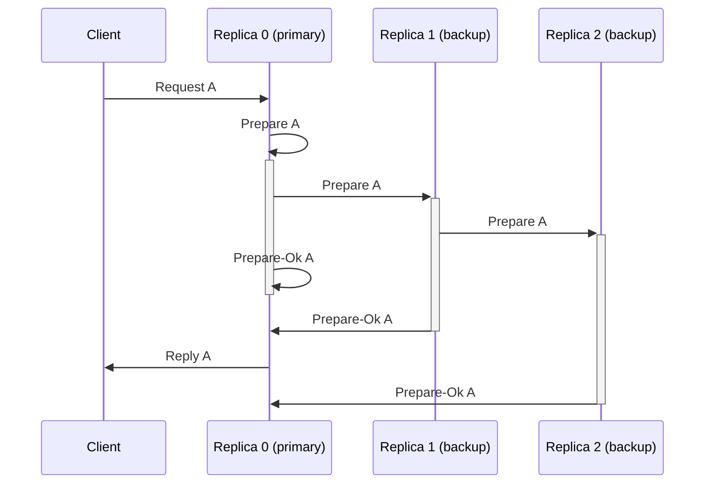

# VSR

Documentation for (roughly) code in the `src/vsr` directory.

# Glossary

Consensus:

- _checkpoint_: Ensure that all updates from the past wrap of the WAL are durable in the _grid_, then advance the replica's recovery point by updating the superblock. After a checkpoint, the checkpointed WAL entries are safe to be overwritten by the next wrap. (Sidenote: in consensus literature this is sometimes called snapshotting. But we use that term to mean something else.)
- _header_: Identifier for many kinds of messages, including each entry in the VSR log. Passed around instead of the entry when the full entry is not needed (such as view change).
- _journal_: The in-memory data structure that manages the WAL.
- _nack_: Short for negative acknowledgement. Used to determine (during a view change) which entries can be truncated from the log. See [Protocol Aware Recovery](https://www.usenix.org/system/files/conference/fast18/fast18-alagappan.pdf).
- _op_: Short for op-number. An op is assigned to each request that is submitted by the user before being stored in the log. An op is a monotonically increasing integer identifying each message to be handled by consensus. When messages with the same op in different views conflict, view change picks one version to commit. Each user batch (which may contain many batch entries) corresponds to one op. Each op is identified (once inside the VSR log) by a _header_.
- _superblock_: All local state for the replica that cannot be replicated remotely. Loss is protected against by storing `config.superblock_copies` copies of the superblock.
- _view_: A replica is _primary_ for one view. Views are monotonically increasing integers that are incremented each time a new primary is selected.

Storage:

- _zone_: The TigerBeetle data file is made up of zones. The superblock is one zone.
- _grid_: The zone on disk where LSM trees and metadata for them reside.
- _WAL_: Write-ahead log. It is implemented as two on-disk ring buffers. Entries are only overwritten after they have been checkpointed.
- _state sync_: The process of syncing checkpointed data (LSM root information, the _grid_, and the superblock freeset). When a replica lags behind the cluster far enough that their WALs no longer intersect, the lagging replica must state sync to catch up.

# Protocols

### Commands

|           `vsr.Header.Command` |  Source |       Target | Protocols                                                                        |
| -----------------------------: | ------: | -----------: | -------------------------------------------------------------------------------- |
|                         `ping` | replica |      replica | [Ping (Replica-Replica)](#protocol-ping-replica-replica)                         |
|                         `pong` | replica |      replica | [Ping (Replica-Replica)](#protocol-ping-replica-replica)                         |
|                  `ping_client` |  client |      replica | [Ping (Replica-Client)](#protocol-ping-replica-client)                           |
|                  `pong_client` | replica |       client | [Ping (Replica-Client)](#protocol-ping-replica-client)                           |
|                      `request` |  client |      primary | [Normal](#protocol-normal)                                                       |
|                      `prepare` | replica |       backup | [Normal](#protocol-normal), [Repair WAL](#protocol-repair-wal)                   |
|                   `prepare_ok` | replica |      primary | [Normal](#protocol-normal), [Repair WAL](#protocol-repair-wal)                   |
|                        `reply` | primary |       client | [Normal](#protocol-normal), [Repair Client Replies](#protocol-repair-client-replies), [Sync Client Replies](#protocol-sync-client-replies) |
|                       `commit` | primary |       backup | [Normal](#protocol-normal)                                                       |
|            `start_view_change` | replica | all replicas | [Start-View-Change](#protocol-start-view-change)                                 |
|               `do_view_change` | replica | all replicas | [View-Change](#protocol-view-change)                                             |
|                   `start_view` | primary |       backup | [Request/Start View](#protocol-requeststart-view)                                |
|           `request_start_view` |  backup |      primary | [Request/Start View](#protocol-requeststart-view)                                |
|              `request_headers` | replica |      replica | [Repair Journal](#protocol-repair-journal)                                       |
|              `request_prepare` | replica |      replica | [Repair WAL](#protocol-repair-wal)                                               |
|                `request_reply` | replica |      replica | [Repair Client Replies](#protocol-repair-client-replies), [Sync Client Replies](#protocol-sync-client-replies) |
|                      `headers` | replica |      replica | [Repair Journal](#protocol-repair-journal)                                       |
|                     `eviction` | primary |       client | [Client](#protocol-client)                                                       |
|               `request_blocks` | replica |      replica | [Sync Forest](#protocol-sync-forest), [Repair Grid](#protocol-repair-grid)       |
|                        `block` | replica |      replica | [Sync Forest](#protocol-sync-forest), [Repair Grid](#protocol-repair-grid)       |
|      `request_sync_checkpoint` | replica |      replica | [Sync Superblock](#protocol-sync-superblock)                                     |
|              `sync_checkpoint` | replica |      replica | [Sync Superblock](#protocol-sync-superblock)                                     |

### Recovery

Unlike [VRR](https://pmg.csail.mit.edu/papers/vr-revisited.pdf), TigerBeetle does not implement Recovery Protocol (see §4.3).
Instead, replicas persist their VSR state to the superblock.
This ensures that a recovering replica never backtracks to an older view (from the point of view of the cluster).

## Protocol: Ping (Replica-Replica)

Replicas send `command=ping`/`command=pong` messages to one another to synchronize clocks.

## Protocol: Ping (Replica-Client)

Clients send `command=ping_client` (and receive `command=pong_client`) messages to (from) replicas to learn the cluster's current view.

## Protocol: Normal

Normal protocol prepares and commits requests (from clients) and sends replies (to clients).

1. The client sends a `command=request` message to the primary. (If the client's view is outdated, the receiver will forward the message on to the actual primary).
2. The primary converts the `command=request` to a `command=prepare` (assigning it an `op` and `timestamp`).
3. Each replica (in a chain beginning with the primary) performs the following steps concurrently:
    - Write the prepare to the WAL.
    - Forward the prepare to the next replica in the chain.
4. Each replica sends a `command=prepare_ok` message to the primary once it has written the prepare to the WAL.
5. When a primary collects a [replication quorum](#quorums) of `prepare_ok`s _and_ it has committed all preceding prepares, it commits the prepare.
6. The primary replies to the client.
7. The backups are informed that the prepare was committed by either:
    - a subsequent prepare, or
    - a periodic `command=commit` heartbeat message.

See also:

  - [VRR](https://pmg.csail.mit.edu/papers/vr-revisited.pdf) §4.1

## Protocol: Start-View-Change

Start-View-Change (SVC) protocol initiates [view-changes](#protocol-view-change) with minimal disruption.

Unlike the Start-View-Change described in [VRR](https://pmg.csail.mit.edu/papers/vr-revisited.pdf) §4.2, this protocol runs in both `status=normal` and `status=view_change` (not just `status=view_change`).

1. Depending on the replica's status:
    - `status=normal` & primary: When the replica has not recently received a `prepare_ok` (and it has a prepare in flight), pause broadcasting `command=commit`.
    - `status=normal` & backup: When the replica has not recently received a `command=commit`, broadcast `command=start_view_change` to all replicas (including self).
    - `status=view_change`: If the replica has not completed a view-change recently, send a `command=start_view_change` to all replicas (including self).
2. (Periodically retry sending the SVC).
3. If the backup receives a `command=commit` or changes views (respectively), stop the `command=start_view_change` retries.
4. If the replica collects a [view-change quorum](#quorums) of SVC messages, transition to `status=view_change` for the next view. (That is, increment the replica's view and start sending a DVC).

This protocol approach enables liveness under asymmetric network partitions. For example, a replica which can send to the cluster but not receive may send SVCs, but if the remainder of the cluster is healthy, they will never achieve a quorum, so the view is stable. When the partition heals, the formerly-isolated replica may rejoin the original view (if it was isolated in `status=normal`) or a new view (if it was isolated in `status=view_change`).

See also:

  - [Raft does not Guarantee Liveness in the face of Network Faults](https://decentralizedthoughts.github.io/2020-12-12-raft-liveness-full-omission/) ("PreVote and CheckQuorum")
  - ["Consensus: Bridging Theory and Practice"](https://web.stanford.edu/~ouster/cgi-bin/papers/OngaroPhD.pdf) §6.2 "Leaders" describes periodically committing a heartbeat to detect stale leaders.

## Protocol: View-Change

A replica sends `command=do_view_change` to all replicas, with the `view` it is attempting to start.
- The _primary_ of the `view` collects a [view-change quorum](#quorums) of DVCs.
- The _backup_ of the `view` uses to `do_view_change` to updates its current `view` (transitioning to `status=view_change`).

DVCs include headers from prepares which are:
- _present_: A valid header, corresponding to a valid prepare in the replica's WAL.
- _missing_: A valid header, corresponding to a prepare that the replica has not prepared/acked.
- _corrupt_: A valid header, corresponding to a corrupt prepare in the replica's WAL.
- _blank_: A placeholder (fake) header, corresponding to a header that the replica has never seen.
- _fault_: A placeholder (fake) header, corresponding to a header that the replica _may have_ prepared/acked.

If the new primary collects a _nack quorum_ of _blank_ headers for a particular possibly-uncommitted op, it truncates the log.

These cases are farther distinguished during [WAL repair](#protocol-repair-wal).

When the primary collects its DVC quorum:
1. If any DVC in the quorum is ahead of the primary by more than one checkpoint,
   the new primary "forfeits" (that is, it immediately triggers another view change).
2. If any DVC in the quorum is ahead of the primary by more than one checkpoint,
   and any messages in the next checkpoint are possibly committed,
   the new primary forfeits.
3. The primary installs the headers to its suffix.
4. Then the primary repairs its headers. ([Protocol: Repair Journal](#protocol-repair-journal)).
5. Then the primary repairs its prepares. ([Protocol: Repair WAL](#protocol-repair-wal)) (and potentially truncates uncommitted ops).
6. Then primary commits all prepares which are not known to be uncommitted.
7. Then the primary transitions to `status=normal` and broadcasts a `command=start_view`.

## Protocol: Request/Start View

### `request_start_view`

A backup sends a `command=request_start_view` to the primary of a view when any of the following occur:

  - the backup learns about a newer view via a `command=commit` message, or
  - the backup learns about a newer view via a `command=prepare` message, or
  - the backup discovers `commit_max` exceeds `min(op_head, op_checkpoint_next_trigger)` (during repair), or
  - a replica recovers to `status=recovering_head`

### `start_view`

When a `status=normal` primary receives `command=request_start_view`, it replies with a `command=start_view`.
`command=start_view` includes the view's current suffix — the headers of the latest messages in the view.

Upon receiving a `start_view` for the new view, the backup installs the suffix, transitions to `status=normal`, and begins repair.

A `start_view` contains the following headers (which may overlap):

  - The suffix: `pipeline_prepare_queue_max` headers from the head op down.
  - The "hooks": the header of any previous checkpoint triggers within our repairable range.
    This helps a lagging replica catch up. (There are at most 2).

## Protocol: Repair Journal

`request_headers` and `headers` repair gaps or breaks in a replica's journal headers.
Repaired headers are a prerequisite for [repairing prepares](#protocol-repair-wal).

Because the headers are repaired backwards (from the head) by hash-chaining, it is safe for both backups and transitioning primaries.

Gaps/breaks in a replica's journal headers may occur:

  - On a backup, receiving nonconsecutive ops, leaving a gap in its headers.
  - On a backup, which has not finished repair.
  - On a new primary during a view-change, which has not finished repair.

## Protocol: Repair WAL

The replica's journal tracks which prepares the WAL requires — i.e. headers for which either:
- no prepare was ever received, or
- the prepare was received and written, but was since discovered to be corrupt

During repair, missing/damaged prepares are requested & repaired chronologically, which:
- improves the chances that older entries will be available, i.e. not yet overwritten
- enables better pipelining of repair and commit.

In response to a `request_prepare`:

- Reply the `command=prepare` with the requested prepare, if available and valid.
- Otherwise do not reply. (e.g. the corresponding slot in the WAL is corrupt)

Per [PAR's CTRL Protocol](https://www.usenix.org/system/files/conference/fast18/fast18-alagappan.pdf), we do not nack corrupt entries, since they _might_ be the prepare being requested.

## Protocol: Repair Client Replies

The replica stores the latest reply to each active client.

During repair, corrupt client replies are requested & repaired.

In response to a `request_reply`:

- Respond with the `command=reply` (the requested reply), if available and valid.
- Otherwise do not reply.

## Protocol: Client

1. Client sends `command=request operation=register` to registers with the cluster by starting a new request-reply hashchain. (See also: [Protocol: Normal](#protocol-normal)).
2. Client receives `command=reply operation=register` from the cluster. (If the cluster is at the maximum number of clients, it evicts the oldest).
3. Repeat:
    1. Send `command=request` to cluster.
    2. If the client has been evicted, receive `command=eviction` from the cluster. (The client must re-register before sending more requests.)
    3. If the client has not been evicted, receive `command=reply` from cluster.

See also:

  - [Integration: Client Session Lifecycle](../design/client-sessions.md#lifecycle)
  - [Integration: Client Session Eviction](../design/client-sessions.md#eviction)

## Protocol: Repair Grid

Grid repair is triggered when a replica discovers a corrupt (or missing) grid block.

1. The repairing replica sends a `command=request_blocks` to any other replica. The message body contains a list of block `address`/`checksum`s.
2. Upon receiving a `command=request_blocks`, a replica reads its own grid to check for the requested blocks. For each matching block found, reply with the `command=block` message (the block itself).
3. Upon receiving a `command=block`, a replica writes the block to its grid, and resolves the reads that were blocked on it.

Note that _both sides_ of grid repair can run while the grid is being opened during replica startup.
That is, a replica can help other replicas repair and repair itself simultaneously.

TODO Describe state sync fallback.

## Protocol: Sync Superblock

State sync synchronizes the state of a lagging/divergent replica with the healthy cluster.

State sync is used when when a lagging replica's log no longer intersects with the cluster's current log —
[WAL repair](#protocol-repair-wal) cannot catch the replica up.

This protocol updates the replica's superblock with a more recent one.

See [State Sync](./sync.md) for details.

## Protocol: Sync Client Replies

Sync missed client replies using [Protocol: Repair Grid](#protocol-repair-client-replies).

(Runs immediately after [Protocol: Sync Superblock](#protocol-sync-superblock).)
See [State Sync](./sync.md) for details.

## Protocol: Sync Forest

Sync missed LSM manifest and table blocks using [Protocol: Repair Grid](#protocol-repair-grid).

(Runs immediately after [Protocol: Sync Superblock](#protocol-sync-superblock).)
See [State Sync](./sync.md) for details.

## Protocol: Reconfiguration

TODO (Unimplemented)

# Quorums

- The _replication quorum_ is the minimum number of replicas required to complete a commit.
- The _view-change quorum_ is the minimum number of replicas required to complete a view-change.
- The _nack quorum_ is the minimum number of unique nacks required to truncate an uncommitted op.

With the default configuration:

|      **Replica Count** |   1 |     2 |  3 |  4 |  5 |  6 |
| ---------------------: | --: | ----: | -: | -: | -: | -: |
| **Replication Quorum** |   1 |     2 |  2 |  2 |  3 |  3 |
| **View-Change Quorum** |   1 |     2 |  2 |  3 |  3 |  4 |
|        **Nack Quorum** |   1 | **1** |  2 |  3 |  3 |  4 |

See also:

  - `constants.quorum_replication_max` for configuration.
  - [Flexible Paxos](https://fpaxos.github.io/)

## Further reading

* [Viewstamped Replication Revisited](https://pmg.csail.mit.edu/papers/vr-revisited.pdf)
* [Protocol Aware Recovery](https://www.usenix.org/system/files/conference/fast18/fast18-alagappan.pdf)
