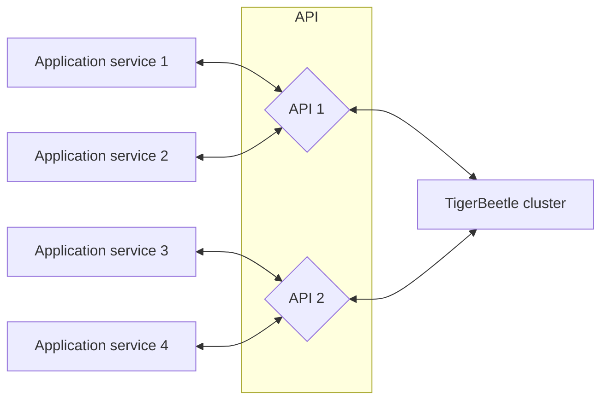

# Integration

TigerBeetle is designed to guard against bugs not only in its [own code](../TIGER_STYLE.md), but
at the boundaries, in the application code which interfaces with TigerBeetle.
This is exhibited by the client's API design, which may be [surprising](#retries) when contrasted
with a more conventional database.

Strict consistency guarantees at the database level simplify application logic and error handling
farther up the stack.


## Consistency

TigerBeetle provides strict serializability (serializability + linearizability) to each
[client session](#client-sessions).

But consistency models are notoriously arcane — what specifically does this mean for applications
in practice?

- [**Client sessions**](#client-sessions)
  - A client session may have at most one in-flight request.
  - A client session reads its own writes.
  - A client session observes writes in the order that they occur on the cluster.
  - A client session observes [`debits_posted`](../reference/accounts.md#debits_posted) and
    [`credits_posted`](../reference/accounts.md#credits_posted) as monotonically increasing.
  - A client session never observes uncommitted updates.
  - A client session never observes a broken invariant (e.g.
    [`flags.credits_must_not_exceed_debits`](../reference/accounts.md#flags.credits_must_not_exceed_debits)).
  - Multiple client sessions may receive replies [out of order](#reply-order) relative to one another.
- [**Requests**](#requests)
  - A request executes within the cluster at most once.
  - Requests do not [time out](#retries) — a timeout typically implies failure, which cannot be
    conclusively determined in the context of network faults.
  - Requests retried by their original client session receive identical replies.
  - Requests retried by a different client (same request body, different session) may receive
    [different replies](#consistency-with-foreign-databases).
  - Operations within a request are executed in sequential order.
  - Operations within a request do not interleave with other requests.
    (TODO: Can timeouts interleave batches, or should we shift the batch so that timeouts land
    entirely before/after?)
- **Operations**
  - Once committed, an operation will always be committed — the cluster's state never backtracks.
  - [Accounts](../reference/accounts.md) are immutable — once created, they are never modified
    (excluding balance fields, which are modified by transfers).
  - [Transfers](../reference/transfers.md) are immutable — once created, they are never modified.
  - Transfer [timeouts](../reference/transfers.md#timeout) are deterministic, driven by the
    cluster's timestamp.
  - Object timestamps are cluster-unique. For objects `A` and `B`, `A.timestamp ≠ B.timestamp`.
  - Object timestamps are strictly increasing For objects `A` and `B`, if
    `A.timestamp < B.timestamp`, then `A` was committed earlier than `B`.

### Reply Order

Replies to a client session always arrive in order — a client session may have only one request
in-flight, and clients ignore (duplicate) replies to their prior requests.

- Requests are executed in the order they arrive at the cluster's primary.
- Replies to different clients may arrive out of order.

#### Example

Consider two clients `A` and `B`:

  1. Client `A` sends request `A₁`.
  2. Client `B` sends request `B₁`.

Client `A` sent its request first, but requests `A₁` and `B₁` may execute in either order —
whichever arrives first at the primary will execute first.

In this diagram, the requests are delivered out of order — `B₁` then `A₁`:

```mermaid
sequenceDiagram
    autonumber
    participant Client A
    participant Client B
    participant (Network)
    participant Cluster
    Client A->>(Network): A₁ (request)
    Client B->>(Network): B₁ (request)
    Note over (Network): Request A₁ is delayed by the network.
    (Network)->>Cluster: B₁ (request)
    (Network)->>Cluster: A₁ (request)
    Cluster->>(Network): B₁ (reply)
    Cluster->>(Network): A₁ (reply)
    (Network)->>Client B: B₁(reply)
    (Network)->>Client A: A₁ (reply)
```

Suppose instead `A₁` arrives and executes before `B₁`.
The replies may be delivered in the same order (`A₁` then `B₁`), or they may be reordered, as shown below:

```mermaid
sequenceDiagram
    autonumber
    participant Client A
    participant Client B
    participant (Network)
    participant Cluster
    Client A->>(Network): A₁ (request)
    Client B->>(Network): B₁ (request)
    (Network)->>Cluster: A₁ (request)
    (Network)->>Cluster: B₁ (request)
    Cluster->>(Network): A₁ (reply)
    Cluster->>(Network): B₁ (reply)
    Note over (Network): Reply A₁ is delayed by the network.
    (Network)->>Client B: B₁(reply)
    (Network)->>Client A: A₁ (reply)
```

### Retries

A client will retry a request until either:

- the client receives a corresponding reply from the cluster, or
- the client is terminated.

Unlike most database or RPC clients:

- the TigerBeetle client will never time out
- the TigerBeetle client has no retry limits
- the TigerBeetle does not surface network errors

With TigerBeetle's strict consistency model, surfacing these errors at the client/application level
would be misleading, because they would imply that a request did not execute, when that is not known:

- A request delayed by the network could execute after its timeout.
- A reply delayed by the network could execute before its timeout.

### Consistency with Foreign Databases

TigerBeetle objects may correspond to objects in a foreign data store (e.g. another DBMS). Keeping
multiple data stores consistent (in sync) is subtle in the context of application process faults.

Object creation operations are idempotent, but the first attempt will return `.ok`,
while all successive identical attempts return `.exists`. The client may crash after creating
the object, but before receiving the `.ok` reply. Because the session resets, neither that client
nor any others will see the object's corresponding `.ok` result.

Therefore, as an application synchronizes updates between multiple data stores, it must treat
`.exists` as equivalent to `.ok`.

#### Example

Suppose that an application creates users within Postgres, and for each user a
corresponding `Account` in TigerBeetle.

This scenario depicts the typical case:

  1. _Application_: Create user `U₁` in Postgres with `U₁.account_id = A₁` and
    `U₁.account_exists = false`.
  2. _Application_: Send "create account" request `A₁` to the cluster.
  3. _Cluster_: Create `A₁`; reply `CreateAccountResult.ok`.
  4. _Application_: Receive reply `A₁: CreateAccountResult.ok` from the cluster.
  5. _Application_: Set `U₁.account_exists = true`.

But suppose the application crashes and restarts immediately after sending its request (step 2):

  1. _Application_: Create user `U₁` in Postgres with `U₁.account_id = A₁` and
    `U₁.account_exists = false`.
  2. _Application_: Send "create account" request `A₁` to the cluster.
  3. _Application_: Crash. Restart.
  4. _Cluster_: Create `A₁`; reply `CreateAccountResult.ok` — but the application session has reset,
    so this reply never reaches the application).
  5. _Application_: Send "create account" request `A₁` to the cluster.
  6. _Cluster_: Create `A₁`; reply `CreateAccountResult.exists`.
  7. _Application_: Receive reply `A₁: CreateAccountResult.exists` from the cluster.
  8. _Application_: Set `U₁.account_exists = true`.

In the second case, the application observes that the account is created by receiving `.exists`
(step 6) instead of `.ok`.

Note that the retry (step 5) reused the same account `id` from the original request (step 2).
An alternate approach is to generate a new account `id` for each "create account" attempt,
and perhaps store the account's `id` on `U₁` when it is successfully created.
Then account creation could be restricted to the `.ok` code — but application restarts would leave
orphaned accounts in TigerBeetle, which may be confusing for auditing and debugging.


## Client Sessions

A _client session_ is a sequence of alternating [requests](#requests) and replies between a client
and a cluster.

A client session may have at most one in-flight request — i.e. at most one unique request on the
network for which a reply has not been received. This simplifies consistency and allows the cluster
to statically guarantee capacity in its incoming message queue. Additional requests from the
application are queued by the client, to be dequeued and sent when their preceding request receives
a reply.

TigerBeetle has a [hard limit](#client-session-eviction) on the number of concurrent
client sessions, and encourages minimizing the number of concurrent clients to
[maximize throughput](#batching-operations).

### Client Session Lifecycle

A client session begins when a client registers itself with the cluster.

- Each client session has a unique identifier ("client id") — an ephemeral random 128-bit UUID.
- The client sends a special "register" message which is committed by the cluster, at which point
  the client is "registered" — once it receives the reply, it may begin sending requests.
- Client registration is handled automatically by the TigerBeetle client implementation when the
  client is initialized, before it sends its first request.
- When a client restarts (for example, the application service running the TigerBeetle client is
  restarted) it does not resume its old session — it starts a new session, with a new (random)
  client id.

A client session ends when either:

  - the client session is [evicted](#client-session-eviction), or
  - the client terminates

— whichever occurs first.

### Client Session Eviction

When a client session is registering and the number of active sessions in the cluster is already at
the cluster's concurrent client session
[limit](https://tigerbeetle.com/blog/a-database-without-dynamic-memory/) (`config.clients_max`,
32 by default), an existing client session must be evicted to make space for
the new session.

- After a session is evicted by the cluster, no future requests from that session will ever execute.
- The evicted session is chosen as the session that committed a request the longest time ago.

The cluster sends a message to notify the evicted session that it has ended. Typically the evicted
client is no longer active (already terminated), but if it is active, the eviction message causes it
to self-terminate, bubbling up to the application as an `session evicted` error.

(TODO: Right now evicted clients panic — fix that so this is accurate.)

If active clients are terminating with `session evicted` errors, it (most likely) indicates that
the application is trying to run [too many](#batching-operations) concurrent clients.


## Requests

A _request_ is a [batch](#batching-operations) of one or more operations sent to the cluster in a
single message.

- The cluster commits an entire batch at once, each operation in series.
- Unless [linked](../reference/transfers.md#flags.linked), operations within
  a request can succeed or fail independently.
- The cluster returns a single reply for each unique request it commits.
- All operations within a request batch share the same type.

(TODO: Link "succeed or fail" to the `CreateAccountResult`/`CreateTransferResult` docs when they
are done to clarify that we are talking about failure at a state machine level).


### Batching Operations

To achieve high throughput, TigerBeetle amortizes the overhead of consensus and I/O by
batching many operations in each request. For the best performance, each request should batch as
many operations as possible. Typically this means funneling operations through fewer client
instances.

The maximum number of operations per batch is dependent on the maximum message size
(`config.message_size_max`) and the operation type.
(TODO: Expose batch size in the client instead).

In the default configuration, the batch sizes are:

| operation          | batch size |
| ------------------ | ---------: |
| `lookup_accounts`  | 8191       |
| `lookup_transfers` | 8191       |
| `create_accounts`  | 8191       |
| `create_transfers` | 8191       |

Presently the client application is responsible for batching operations, but only as a stopgap
because this has not yet been implemented within the clients themselves.

#### API Layer Architecture

In some application architectures, the number of services that need to query TigerBeetle may:
- [exceed `config.clients_max`](#client-session-eviction), or
- may require additional [batching](#batching-operations) to optimize throughput.

Rather than each service connecting to TigerBeetle directly, application services can forward their
requests to a pool of intermediate services (the "API layer") which can coalesce operations from
many application services into requests, and forward back the respective
replies. This approach enables larger batch sizes and higher throughput, but comes at a cost: the
application services' sessions are no longer linearizable, because the API services may restart at
any time relative to the application service.




## Data Modeling

TigerBeetle is a domain-specific database — its schema of [`Account`s](../reference/accounts.md)
and [`Transfer`s](../reference/transfers.md) is built-in and fixed. In return for this prescriptive
design, it provides excellent performance, integrated business logic, and powerful invariants.
This section is a sample of techniques for mapping an application's requirements onto TigerBeetle's
data model. Which (if any) of these techniques are suitable is highly application-specific.

When possible, encoding application invariants directly in TigerBeetle rather than implementing
them in the application itself (or with a foreign database) minimizes round-trips and coordination.
This is useful for both maintaining consistency and performance.

### `user_data`

`user_data` is the most flexible field in the schema (for both
[accounts](../reference/accounts.md#user_data) and [transfers](../reference/transfers.md#user_data)).
`user_data`'s contents are arbitrary, interpreted only by the application.

`user_data` is indexed for efficient point and range queries.

Example uses:

- Set `user_data` to a "foreign key" — that is, an identifier of a corresponding object within
  another database.
- Set `user_data` to a group identifier for objects that will be queried together.
- Set `user_data` to a transfer or account `id`.
  (TODO: Can we use this for join queries via the query API, or must the application implement them?)

### `id`

[`Account`](../reference/accounts.md#id) and [`Transfer`](../reference/transfers.md#id) identifiers
must be unique, so randomly-generated UUIDs are the natural choice — but not the only option.

`id` is mostly accessed by point queries, but it is indexed for efficient range queries as well.

When designing any id scheme:

- `id`'s primary purpose is to ensure idempotence of object creation — this can be [difficult in the context of application crash recovery](#consistency-with-foreign-databases).
- Be careful to [avoid `id` collisions](https://en.wikipedia.org/wiki/Birthday_problem).
- An account and a transfer may share the same `id` — they belong to different "namespaces".
- Avoid requiring a central oracle to generate each unique `id` (e.g. an auto-increment field in SQL). A central oracle may become a performance bottleneck when creating accounts/transfers.

#### Examples
##### Reuse Foreign Identifier

Set `id` to a "foreign key" — that is, reuse an identifier of a corresponding object from
[another database](#consistency-with-foreign-databases).

For example, if every user (within the application's database) has a single account, then the
identifier within the foreign database can be used as the `Account.id` within TigerBeetle.

To reuse the foreign identifier, it must conform to TigerBeetle's `id`
[constraints](../reference/accounts.md#id).

This technique is most appropriate when integrating TigerBeetle with an existing application.
It is not ideal because it
[complicates consistency around application crash recover](#consistency-with-foreign-databases)
and may have a bottleneck at the foreign database.

##### Logically Grouped Objects

Often accounts or transfers are logically grouped together from the application's perspective.
For example, a simple currency exchange transaction is one logical transfer conducted between
four accounts — two physical transfers.

A non-random identifier scheme can:

  - leave `user_data` free for a different purpose, and
  - allow a group's members and roles to be derived by the application code,

without relying on a [foreign database](#reuse-foreign-identifier) to store metadata for each
member of the group.

A group may (but does not necessarily) correspond to objects chained by
[`flags.linked`](../reference/transfers.md#flags.linked).

###### Identifier Offsets

For each group, generate a single "root" `id`, and set group member's `id`s relative to that root.

- From the root, use known offsets to derive member identifiers (e.g. `root + 1`).
- From a group member, use `code`, `ledger`, or both to determine the object's role and derive the
  root identifier.

This technique enables a simple range query to iterate every member of a target group.

If groups are large (or variable-sized), it may be be preferable to rely on
[`user_data` for grouping](#user_data) to sidestep the risk of `id` collisions.

###### Identifier Prefixes

When a group consists of a fixed number of heterogeneous members (each with a distinct role),
`id`s with the same role could be created with a common, application-known prefix.
In this arrangement, the suffix could be randomized, but shared by a group's members.

- A group's role is derived from its `id`'s prefix.
- A group's members are derived by swapping the `id` prefix.

This technique enables a simple range query to iterate every object with a target role.
