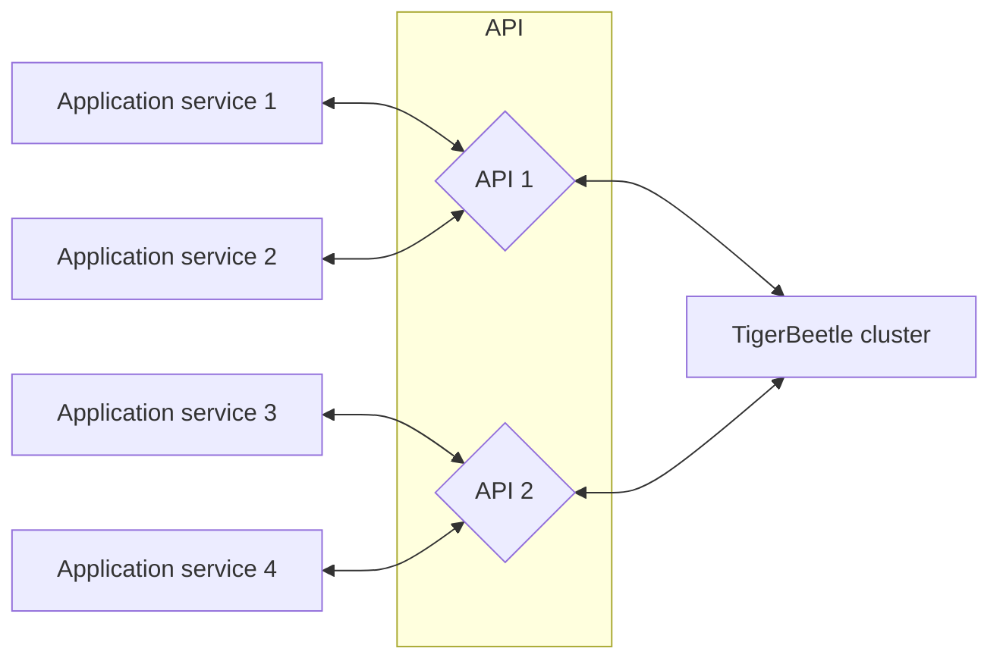

# Integration

TigerBeetle is designed to guard against bugs not only in its
[own code](https://github.com/tigerbeetledb/tigerbeetle/blob/main/docs/TIGER_STYLE.md), but
at the boundaries, in the application code which interfaces with TigerBeetle.
This is exhibited by the client's API design, which may be surprising (see [Retries](#retries)) when
contrasted with a more conventional database.

Strict consistency guarantees (at the database level) simplify application logic and error handling
farther up the stack.


## Consistency

TigerBeetle provides strict serializability
([serializability + linearizability](http://www.bailis.org/blog/linearizability-versus-serializability/))
to each [client session](#client-sessions).

But consistency models can seem arcane.
What specific guarantees does TigerBeetle provide to applications?

#### Sessions

- A client session may have at most one in-flight request.
- A client session reads its own writes.
- A client session observes writes in the order that they occur on the cluster.
- A client session observes [`debits_posted`](../reference/accounts.md#debits_posted) and
  [`credits_posted`](../reference/accounts.md#credits_posted) as monotonically increasing.
  That is, a client session will never see `credits_posted` or `debits_posted` decrease.
- A client session never observes uncommitted updates.
- A client session never observes a broken invariant (e.g.
  [`flags.credits_must_not_exceed_debits`](../reference/accounts.md#flagscredits_must_not_exceed_debits)
  or [`flags.linked`](../reference/transfers.md#flagslinked)).
- Multiple client sessions may receive replies [out of order](#reply-order) relative to one another.
- A client session can consider a request executed when it receives a reply for the request.

#### Requests

- A request executes within the cluster at most once.
- Requests do not [time out](#retries) — a timeout typically implies failure, which cannot be
  conclusively determined in the context of network faults.
- Requests retried by their original client session receive identical replies.
- Requests retried by a different client (same request body, different session) may receive
  [different replies](#consistency-with-foreign-databases).
- Events within a request are executed in sequential order.
- Events within a request do not interleave with events from other requests.
  (TODO: Can timeouts interleave batches, or should we shift the batch so that timeouts land
  entirely before/after?)
- All events within a request batch are committed, or none are.

#### Events

- Once committed, an event will always be committed — the cluster's state never backtracks.
- Within a cluster, object timestamps are unique.
  For all objects `A` and `B` belonging to the same cluster, `A.timestamp ≠ B.timestamp`.
- Within a cluster, object timestamps are strictly increasing.
  For all objects `A` and `B` belonging to the same cluster, if `A.timestamp < B.timestamp`,
  then `A` was committed earlier than `B`.
- If a client session is terminated and restarts, it is guaranteed to see updates for which the
  corresponding reply was received prior to termination.
- If a client session is terminated and restarts, it is _not_ guaranteed to see updates for
  which the corresponding reply was _not_ received prior to the restart. Those updates may
  occur at any point in the future, or never. Handling application crash recovery safely requires
  [using `id`s to idempotently retry events](#consistency-with-foreign-databases).

#### Accounts

- Accounts are immutable — once created, they are never modified
  (excluding balance fields, which are modified by transfers).
- There is at most one `Account` with a particular `id`.
- The sum of all accounts' `debits_pending` equals the sum of all accounts' `credits_pending`.
- The sum of all accounts' `debits_posted` equals the sum of all accounts' `credits_posted`.

#### Transfers

- Transfers are immutable — once created, they are never modified.
- There is at most one `Transfer` with a particular `id`.
- A [pending transfer](../reference/transfers.md#pending-transfer) resolves at most once.
- Transfer [timeouts](../reference/transfers.md#timeout) are deterministic, driven
  by the cluster's timestamp.

### Reply Order

Replies to a client session always arrive in order — a client session may have only one request
in-flight, and clients ignore (duplicate) replies to their prior requests.

- Requests are executed in the order they arrive at the cluster's primary.
- Replies to different clients may arrive out of order.

#### Example

Consider two clients `A` and `B`:

  1. Client `A` sends request `A₁`.
  2. Client `B` sends request `B₁`.

Client `A` sent its request first, but requests `A₁` and `B₁` may execute in either order —
whichever arrives first at the primary will execute first.

In this diagram, the requests are delivered out of order — `B₁` then `A₁`:

```mermaid
sequenceDiagram
    autonumber
    participant Client A
    participant Client B
    participant (Network)
    participant Cluster
    Client A->>(Network): A₁ (request)
    Client B->>(Network): B₁ (request)
    Note over (Network): Request A₁ is delayed by the network.
    (Network)->>Cluster: B₁ (request)
    (Network)->>Cluster: A₁ (request)
    Cluster->>(Network): B₁ (reply)
    Cluster->>(Network): A₁ (reply)
    (Network)->>Client B: B₁(reply)
    (Network)->>Client A: A₁ (reply)
```

Suppose instead `A₁` arrives and executes before `B₁`.
The replies may be delivered in the same order (`A₁` then `B₁`), or they may be reordered, as shown below:

```mermaid
sequenceDiagram
    autonumber
    participant Client A
    participant Client B
    participant (Network)
    participant Cluster
    Client A->>(Network): A₁ (request)
    Client B->>(Network): B₁ (request)
    (Network)->>Cluster: A₁ (request)
    (Network)->>Cluster: B₁ (request)
    Cluster->>(Network): A₁ (reply)
    Cluster->>(Network): B₁ (reply)
    Note over (Network): Reply A₁ is delayed by the network.
    (Network)->>Client B: B₁(reply)
    (Network)->>Client A: A₁ (reply)
```

### Retries

A [client session](#client-sessions) will automatically retry a request until either:

- the client receives a corresponding reply from the cluster, or
- the client is terminated.

Unlike most database or RPC clients:

- the TigerBeetle client will never time out
- the TigerBeetle client has no retry limits
- the TigerBeetle client does not surface network errors

With TigerBeetle's strict consistency model, surfacing these errors at the client/application level
would be misleading. An error would imply that a request did not execute, when that is not known:

- A request delayed by the network could execute after its timeout.
- A reply delayed by the network could execute before its timeout.

### Consistency with Foreign Databases

TigerBeetle objects may correspond to objects in a foreign data store (e.g. another DBMS). Keeping
multiple data stores consistent (in sync) is subtle in the context of application process faults.

Object creation events are idempotent, but only the first attempt will return `.ok`,
while all successive identical attempts return `.exists`. The client may crash after creating
the object, but before receiving the `.ok` reply. Because the session resets, neither that client
nor any others will see the object's corresponding `.ok` result.

Therefore, to recover to the correct state after a crash, an application that synchronizes updates
between multiple data stores must treat `.exists` as equivalent to `.ok`.

#### Example

Suppose that an application creates users within Postgres, and for each user a
corresponding `Account` in TigerBeetle.

This scenario depicts the typical case:

  1. _Application_: Create user `U₁` in Postgres with `U₁.account_id = A₁` and
    `U₁.account_exists = false`.
  2. _Application_: Send "create account" request `A₁` to the cluster.
  3. _Cluster_: Create `A₁`; reply `ok`.
  4. _Application_: Receive reply `A₁: ok` from the cluster.
  5. _Application_: Set `U₁.account_exists = true`.

But suppose the application crashes and restarts immediately after sending its request (step 2):

  1. _Application_: Create user `U₁` in Postgres with `U₁.account_id = A₁` and
    `U₁.account_exists = false`.
  2. _Application_: Send "create account" request `A₁` to the cluster.
  3. _Application_: Crash. Restart.
  4. _Cluster_: Create `A₁`; reply `ok` — but the application session has reset,
    so this reply never reaches the application).
  5. _Application_: Send "create account" request `A₁` to the cluster.
  6. _Cluster_: Create `A₁`; reply `exists`.
  7. _Application_: Receive reply `A₁: exists` from the cluster.
  8. _Application_: Set `U₁.account_exists = true`.

In the second case, the application observes that the account is created by receiving `.exists`
(step 6) instead of `.ok`.

Note that the retry (step 5) reused the same account `id` from the original request (step 2).
An alternate approach is to generate a new account `id` for each "create account" attempt,
and perhaps store the account's `id` on `U₁` when it is successfully created.
Then account creation could be restricted to the `.ok` code — but application restarts would leave
orphaned accounts in TigerBeetle, which may be confusing for auditing and debugging.


## Client Sessions

A _client session_ is a sequence of alternating [requests](#client-requests) and replies between a
client and a cluster.

A client session may have at most one in-flight request — i.e. at most one unique request on the
network for which a reply has not been received. This simplifies consistency and allows the cluster
to statically guarantee capacity in its incoming message queue. Additional requests from the
application are queued by the client, to be dequeued and sent when their preceding request receives
a reply.

TigerBeetle has a [hard limit](#client-session-eviction) on the number of concurrent
client sessions, and encourages minimizing the number of concurrent clients to
[maximize throughput](#batching-events).

### Client Session Lifecycle

A client session begins when a client registers itself with the cluster.

- Each client session has a unique identifier ("client id") — an ephemeral random 128-bit id.
- The client sends a special "register" message which is committed by the cluster, at which point
  the client is "registered" — once it receives the reply, it may begin sending requests.
- Client registration is handled automatically by the TigerBeetle client implementation when the
  client is initialized, before it sends its first request.
- When a client restarts (for example, the application service running the TigerBeetle client is
  restarted) it does not resume its old session — it starts a new session, with a new (random)
  client id.

A client session ends when either:

  - the client session is [evicted](#client-session-eviction), or
  - the client terminates

— whichever occurs first.

### Client Session Eviction

When a client session is registering and the number of active sessions in the cluster is already at
the cluster's concurrent client session
[limit](https://tigerbeetle.com/blog/a-database-without-dynamic-memory/) (`config.clients_max`,
32 by default), an existing client session must be evicted to make space for
the new session.

- After a session is evicted by the cluster, no future requests from that session will ever execute.
- The evicted session is chosen as the session that committed a request the longest time ago.

The cluster sends a message to notify the evicted session that it has ended. Typically the evicted
client is no longer active (already terminated), but if it is active, the eviction message causes it
to self-terminate, bubbling up to the application as an `session evicted` error.

(TODO: Right now evicted clients panic — fix that so this is accurate.)

If active clients are terminating with `session evicted` errors, it (most likely) indicates that
the application is trying to run [too many](#batching-events) concurrent clients.


## Client Requests

A _request_ is a [batch](#batching-events) of one or more
[operation events](../reference/operations/index.md) sent to the cluster in a single message.

- All events within a request batch share the same operation type.
- The cluster commits an entire batch at once, each event in series.
- The cluster returns a single reply for each unique request it commits.
- The cluster's reply contains results corresponding to each event in the request.
- Unless [linked](../reference/transfers.md#flagslinked), events within a request
  [succeed or fail](../reference/operations/create_transfers.md#result) independently.


### Batching Events

To achieve high throughput, TigerBeetle amortizes the overhead of consensus and I/O by
batching many operation events in each request. For the best performance, each request should batch
as many events as possible. Typically this means funneling events through fewer client instances.

The maximum number of events per batch depends on the maximum message size
(`config.message_size_max`) and the operation type.
(TODO: Expose batch size in the client instead).

In the default configuration, the batch sizes are:

| Operation          | Batch Size |
| ------------------ | ---------: |
| `lookup_accounts`  | 8191       |
| `lookup_transfers` | 8191       |
| `create_accounts`  | 8191       |
| `create_transfers` | 8191       |

Presently the client application is responsible for batching events, but only as a stopgap
because this has not yet been implemented within the clients themselves.

#### API Layer Architecture

In some application architectures, the number of services that need to query TigerBeetle may:
- [exceed `config.clients_max`](#client-session-eviction), or
- may require additional [batching](#batching-events) to optimize throughput.

Rather than each service connecting to TigerBeetle directly, application services can forward their
requests to a pool of intermediate services (the "API layer") which can coalesce events from
many application services into requests, and forward back the respective
replies. This approach enables larger batch sizes and higher throughput, but comes at a cost: the
application services' sessions are no longer linearizable, because the API services may restart at
any time relative to the application service.


