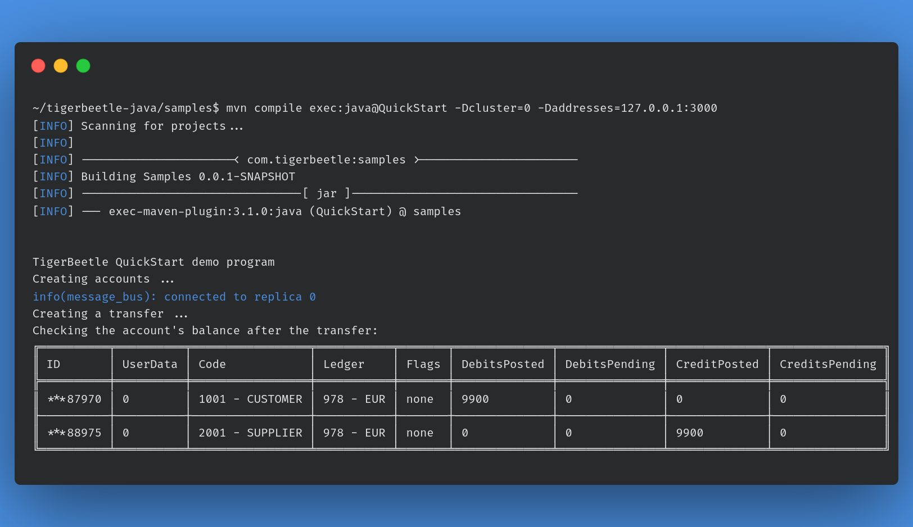

# TigerBeetle Java examples

- The examples require the client library to be compiled. See [the project README](../README.md#building-from-source) for specifics on building from source.

- All examples require the cluster ID and addresses as part of the command line. If not supplied, the program will use the default `cluster=0` and `addresses=127.0.0.1:3000`.
See [the documentation](https://docs.tigerbeetle.com) for more details on how to run TigerBeetle.

### 1. Quick start

A quick overview of TigerBeetle's operation, creating two accounts and a single transfer between them.

Source code:
[QuickStart.java](src/main/java/com/tigerbeetle/samples/QuickStart.java)

How to run:

```bash
cd samples
mvn compile exec:java@QuickStart -Dcluster=0 -Daddresses=127.0.0.1:3000
```

Output:


 
### 2. Linked events

Demonstrates how to create groups of linked accounts and transfers that succeed or fail atomically.

Source code:
[LinkedEvents.java](src/main/java/com/tigerbeetle/samples/LinkedEvents.java)

How to run:

```bash
cd samples
mvn compile exec:java@LinkedEvents -Dcluster=0 -Daddresses=127.0.0.1:3000
```


### 3. Pending transfers

Demonstrates how pending transfers work: pending credits/debits, timeouts, and posting/voiding a transfer.

Source code:
[PendingTransfers.java](src/main/java/com/tigerbeetle/samples/PendingTransfers.java)

How to run:

```bash
cd samples
mvn compile exec:java@PendingTransfers -Dcluster=0 -Daddresses=127.0.0.1:3000
```


