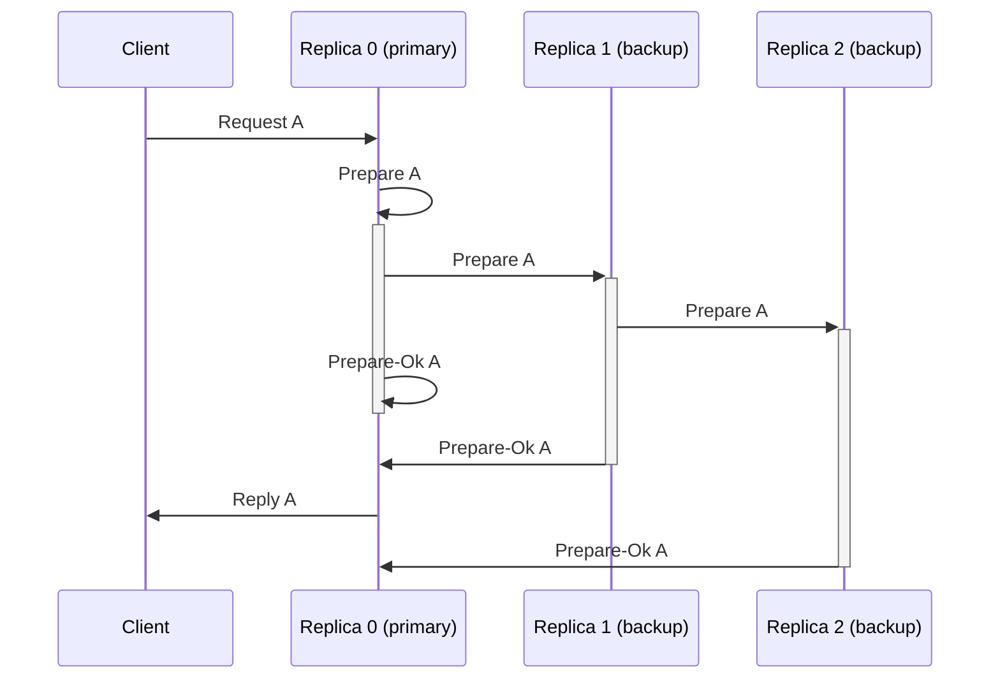

# Protocols

### Commands

| `vsr.Header.Command` |  Source |       Target | Protocols                                                                        |
| -------------------: | ------: | -----------: | -------------------------------------------------------------------------------- |
|               `ping` | replica |      replica | [Ping (Replica-Replica)](#protocol-ping-replica-replica)                         |
|               `pong` | replica |      replica | [Ping (Replica-Replica)](#protocol-ping-replica-replica)                         |
|        `ping_client` |  client |      replica | [Ping (Replica-Client)](#protocol-ping-replica-client)                           |
|        `pong_client` | replica |       client | [Ping (Replica-Client)](#protocol-ping-replica-client)                           |
|            `request` |  client |      primary | [Normal](#protocol-normal)                                                       |
|            `prepare` | replica |       backup | [Normal](#protocol-normal), [Repair WAL](#protocol-repair-wal)                   |
|         `prepare_ok` | replica |      primary | [Normal](#protocol-normal), [Repair WAL](#protocol-repair-wal)                   |
|              `reply` | primary |       client | [Normal](#protocol-normal), [Repair Client Table](#protocol-repair-client-table) |
|             `commit` | primary |       backup | [Normal](#protocol-normal)                                                       |
|  `start_view_change` | replica | all replicas | [Start-View-Change](#protocol-start-view-change)                                 |
|     `do_view_change` | replica | all replicas | [View-Change](#protocol-view-change)                                             |
|         `start_view` | primary |       backup | [Request/Start View](#protocol-requeststart-view)                                |
|          `end_epoch` | replica |      replica | [Reconfiguration](#protocol-reconfiguration)                                     |
| `request_start_view` |  backup |      primary | [Request/Start View](#protocol-requeststart-view)                                |
|    `request_headers` | replica |      replica | [Repair Journal](#protocol-repair-journal)                                       |
|    `request_prepare` | replica |      replica | [Repair WAL](#protocol-repair-wal)                                               |
|      `request_reply` | replica |      replica | [Repair Client Table](#protocol-repair-client-table)                             |
|            `headers` | replica |      replica | [Repair Journal](#protocol-repair-journal)                                       |
|           `eviction` | primary |       client | [Client](#protocol-client)                                                       |

### Recovery

Unlike [VRR](https://pmg.csail.mit.edu/papers/vr-revisited.pdf), TigerBeetle does not implement Recovery Protocol (see §4.3).
Instead, replicas persist their VSR state to the superblock.
This ensures that a recovering replica never backtracks to an older view (from the point of view of the cluster).

## Protocol: Ping (Replica-Replica)

Replicas send `command=ping`/`command=pong` messages to one another to synchronize clocks.

## Protocol: Ping (Replica-Client)

Clients send `command=ping_client` (and receive `command=pong_client`) messages to (from) replicas to learn the cluster's current view.

## Protocol: Normal

Normal protocol prepares and commits requests (from clients) and sends replies (to clients).

1. The client sends a `command=request` message to the primary. (If the client's view is outdated, the receiver will forward the message on to the actual primary).
2. The primary converts the `command=request` to a `command=prepare` (assigning it an `op` and `timestamp`).
3. Each replica (in a chain beginning with the primary) performs the following steps concurrently:
    - Write the prepare to the WAL.
    - Forward the prepare to the next replica in the chain.
4. Each replica sends a `command=prepare_ok` message to the primary once it has written the prepare to the WAL.
5. When a primary collects a [replication quorum](#quorums) of `prepare_ok`s _and_ it has committed all preceding prepares, it commits the prepare.
6. The primary replies to the client.
7. The backups are informed that the prepare was committed by either:
    - a subsequent prepare, or
    - a periodic `command=commit` heartbeat message.

See also:

  - [VRR](https://pmg.csail.mit.edu/papers/vr-revisited.pdf) §4.1

## Protocol: Start-View-Change

Start-View-Change (SVC) protocol initiates [view-changes](#protocol-view-change) with minimal disruption.

Unlike the Start-View-Change described in [VRR](https://pmg.csail.mit.edu/papers/vr-revisited.pdf) §4.2, this protocol runs in both `status=normal` and `status=view_change` (not just `status=view_change`).

1. Depending on the replica's status:
    - `status=normal` & primary: When the replica has not recently received a `prepare_ok` (and it has a prepare in flight), pause broadcasting `command=commit`.
    - `status=normal` & backup: When the replica has not recently received a `command=commit`, broadcast `command=start_view_change` to all replicas (including self).
    - `status=view_change`: If the replica has not completed a view-change recently, send a `command=start_view_change` to all replicas (including self).
2. (Periodically retry sending the SVC).
3. If the backup receives a `command=commit` or changes views (respectively), stop the `command=start_view_change` retries.
4. If the replica collects a [view-change quorum](#quorums) of SVC messages, transition to `status=view_change` for the next view. (That is, increment the replica's view and start sending a DVC).

This protocol approach enables liveness under asymmetric network partitions. For example, a replica which can send to the cluster but not receive may send SVCs, but if the remainder of the cluster is healthy, they will never achieve a quorum, so the view is stable. When the partition heals, the formerly-isolated replica may rejoin the original view (if it was isolated in `status=normal`) or a new view (if it was isolated in `status=view_change`).

See also:

  - [Raft does not Guarantee Liveness in the face of Network Faults](https://decentralizedthoughts.github.io/2020-12-12-raft-liveness-full-omission/) ("PreVote and CheckQuorum")
  - ["Consensus: Bridging Theory and Practice"](https://web.stanford.edu/~ouster/cgi-bin/papers/OngaroPhD.pdf) §6.2 "Leaders" describes periodically committing a heartbeat to detect stale leaders.

## Protocol: View-Change

A replica sends `command=do_view_change` to all replicas, with the `view` it is attempting to start.
- The _primary_ of the `view` collects a [view-change quorum](#quorums) of DVCs.
- The _backup_ of the `view` uses to `do_view_change` to updates its current `view` (transitioning to `status=view_change`).

DVCs include headers from prepares which are:
- _present_: A valid header, corresponding to a valid prepare in the replica's WAL.
- _missing_: A valid header, corresponding to a prepare that the replica has not prepared/acked.
- _corrupt_: A valid header, corresponding to a corrupt prepare in the replica's WAL.
- _blank_: A placeholder (fake) header, corresponding to a header that the replica has never seen.
- _fault_: A placeholder (fake) header, corresponding to a header that the replica _may have_ prepared/acked.

If the new primary collects a _nack quorum_ of _blank_ headers for a particular possibly-uncommitted op, it truncates the log.

These cases are farther distinguished during [WAL repair](#protocol-repair-wal).

When the primary collects its DVC quorum:
1. If any DVC in the quorum is ahead of the primary by more than one checkpoint,
   the new primary "forfeits" (that is, it immediately triggers another view change).
2. If any DVC in the quorum is ahead of the primary by more than one checkpoint,
   and any messages in the next checkpoint are possibly committed,
   the new primary forfeits.
3. The primary installs the headers to its suffix.
4. Then the primary repairs its headers. ([Protocol: Repair Journal](#protocol-repair-journal)).
5. Then the primary repairs its prepares. ([Protocol: Repair WAL](#protocol-repair-wal)) (and potentially truncates uncommitted ops).
6. Then primary commits all prepares which are not known to be uncommitted.
7. Then the primary transitions to `status=normal` and broadcasts a `command=start_view`.

## Protocol: Request/Start View

### `request_start_view`

A backup sends a `command=request_start_view` to the primary of a view when any of the following occur:

  - the backup learns about a newer view via a `command=commit` message, or
  - the backup learns about a newer view via a `command=prepare` message, or
  - the backup discovers `commit_max` exceeds `min(op_head, op_checkpoint_trigger)` (during repair), or
  - a replica recovers to `status=recovering_head`

### `start_view`

When a `status=normal` primary receives `command=request_start_view`, it replies with a `command=start_view`.
`command=start_view` includes the view's current suffix — the headers of the latest messages in the view.

Upon receiving a `start_view` for the new view, the backup installs the suffix, transitions to `status=normal`, and begins repair.

A `start_view` contains the following headers (which may overlap):

  - The suffix: `pipeline_prepare_queue_max` headers from the head op down.
  - The "hooks": the header of any previous checkpoint triggers within our repairable range.
    This helps a lagging replica catch up. (There are at most 2).

## Protocol: Repair Journal

`request_headers` and `headers` repair gaps or breaks in a replica's journal headers.
Repaired headers are a prerequisite for [repairing prepares](#protocol-repair-wal).

Because the headers are repaired backwards (from the head) by hash-chaining, it is safe for both backups and transitioning primaries.

Gaps/breaks in a replica's journal headers may occur:

  - On a backup, receiving nonconsecutive ops, leaving a gap in its headers.
  - On a backup, which has not finished repair.
  - On a new primary during a view-change, which has not finished repair.

## Protocol: Repair WAL

The replica's journal tracks which prepares the WAL requires — i.e. headers for which either:
- no prepare was ever received, or
- the prepare was received and written, but was since discovered to be corrupt

During repair, missing/damaged prepares are requested & repaired chronologically, which:
- improves the chances that older entries will be available, i.e. not yet overwritten
- enables better pipelining of repair and commit.

In response to a `request_prepare`:

- Reply the `command=prepare` with the requested prepare, if available and valid.
- Otherwise do not reply. (e.g. the corresponding slot in the WAL is corrupt)

Per [PAR's CTRL Protocol](https://www.usenix.org/system/files/conference/fast18/fast18-alagappan.pdf), we do not nack corrupt entries, since they _might_ be the prepare being requested.

## Protocol: Repair Client Table

The replica's client table stores the latest reply to each active client.

During repair, corrupt replies are requested & repaired.

In response to a `request_reply`:

- Respond with the `command=reply` (the requested reply), if available and valid.
- Otherwise do not reply.

## Protocol: Client

1. Client sends `command=request operation=register` to registers with the cluster by starting a new request-reply hashchain. (See also: [Protocol: Normal](#protocol-normal)).
2. Client receives `command=reply operation=register` from the cluster. (If the cluster is at the maximum number of clients, it evicts the oldest).
3. Repeat:
    1. Send `command=request` to cluster.
    2. If the client has been evicted, receive `command=eviction` from the cluster. (The client must re-register before sending more requests.)
    3. If the client has not been evicted, receive `command=reply` from cluster.

See also:

  - [Integration: Client Session Lifecycle](../../docs/design/client-sessions.md#lifecycle)
  - [Integration: Client Session Eviction](../../docs/design/client-sessions.md#eviction)

## Protocol: Repair Grid (Backup)

TODO (Unimplemented)

## Protocol: Repair: State Transfer

TODO (Unimplemented)

## Protocol: Membership Change

To remove or add machines to the cluster, two protocols are used in succession:

* [Membership Change](#protocol-membership-change) manipulates the set of standbys (replicas not participating in the consensus)
* [Reconfiguration](#protocol-reconfiguration) then promotes some standbys to active replicas

This structure separates the long, cancelable process of bringing a new replica up-to-date with the cluster via [State Transfer](#protocol-repair-state-transfer), from the short, atomic decision to select consensus participants.

TODO (Unimplemented)

## Protocol: Reconfiguration

Reconfiguration changes the subset of cluster members that participate in the consensus.
In other words, reconfiguration turns some of standbys into active replicas and vice verse, without changing the set of cluster members.
It is a permutation of replica indexes.
Reconfiguration is initiated by the client sending `operation == .reconfiguration` request.

Invariants:

* if `.reconfiguration` request is committed in an epoch, it is the last committed request in the epoch
* the first committed request in an epoch chains either to the root prepare, or to the `.reconfiguration`
* the initial view of the new epoch is deterministically derived from the `.reconfiguration` request

Replicas _may_ be in two epochs at the same time.
For example, if a replica is a standby in the current epoch `E`, but was active in `E-1`, it will accept prepares in epoch `E` and repairs in epoch `E-1`.
The replica won't send `prepare_ok` for epoch `E` because it is a standby in that epoch.
It won't send `prepare_ok` for epoch `E - 1`, because the last request in that epoch has committed.

To handle reconfiguration, replica stores:

* `epoch: u32` --- the last epoch known to be active,
* `members` --- member list for the `epoch`,
* `members_old` --- optional member list for `epoch - 1`, if the new epoch is already active, but it is not yet safe to shutdown the old epoch, which might be needed for repairs.

Additionally, primary stores `reconfiguration_pending` boolean flag.

Processing of `.reconfiguration` request goes as follows:

1. Primary checks that the request is valid (the new configuration is a permutation of current
   one)
2. Primary checks that no reconfiguration is in progress (`members_old == null`)
3. Primary decides whether to accept a valid reconfiguration request.
   For example, primary can reject an otherwise valid request if it knows that would-be active standbys didn't finish state sync.
4. Primary sets `reconfiguration_pending=true` and sends a prepare.
   Primary does not accept new requests when reconfiguration is pending.
   If primary learns about reconfiguration during view change, it also sets `reconfiguration_pending=true`
5. When committing a `.reconfiguration` any replica:
   - sets `members_old` to `members`
   - sets `members` to the new configuration
   - updates its own `replica_index`
   - increments `epoch` and sets `view` to `0`
   - starts `view_change` if it is not a standby in the new epoch
6. When a replication quorum in the new epoch has `commit_min` pointing at the reconfiguration request or greater, `members_old` is set to `null`.
   In particular, if a replica observes `commit_max` in the next WAL wrap after reconfiguration, it can set its `members_old` to `null`.

When replica's `members_old` is not `null` it continues to process some messages in the old epoch.

* All replicas that were active in the old epoch broadcast `.end_epoch` message, containing the last header of the old epoch.
* All replicas that were active in the old epoch continue responding to repair requests.
* Replicas that are active in the new epoch may use old epoch for repairs.
* If replica receives an `.end_epoch` message, it sets its head to the header from the message and transitions to `.normal`.

Clients: TODO (Unimplemented)

# Quorums

- The _replication quorum_ is the minimum number of replicas required to complete a commit.
- The _view-change quorum_ is the minimum number of replicas required to complete a view-change.
- The _nack quorum_ is the minimum number of unique nacks required to truncate an uncommitted op.

With the default configuration:

|      **Replica Count** |   1 |     2 |  3 |  4 |  5 |  6 |
| ---------------------: | --: | ----: | -: | -: | -: | -: |
| **Replication Quorum** |   1 |     2 |  2 |  2 |  3 |  3 |
| **View-Change Quorum** |   1 |     2 |  2 |  3 |  3 |  4 |
|        **Nack Quorum** |   1 | **1** |  2 |  3 |  3 |  4 |

See also:

  - `constants.quorum_replication_max` for configuration.
  - [Flexible Paxos](https://fpaxos.github.io/)
